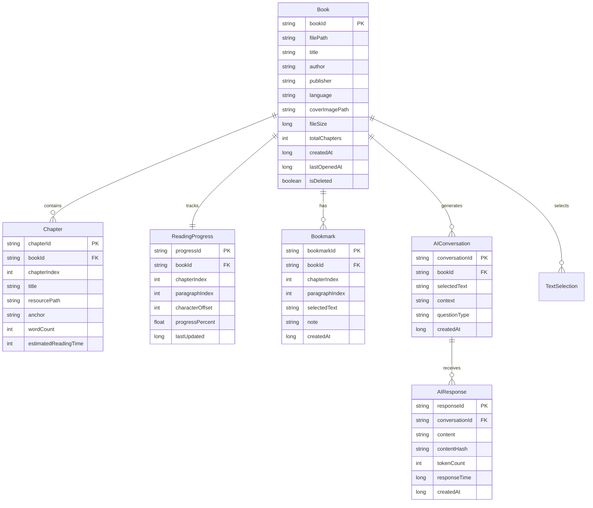
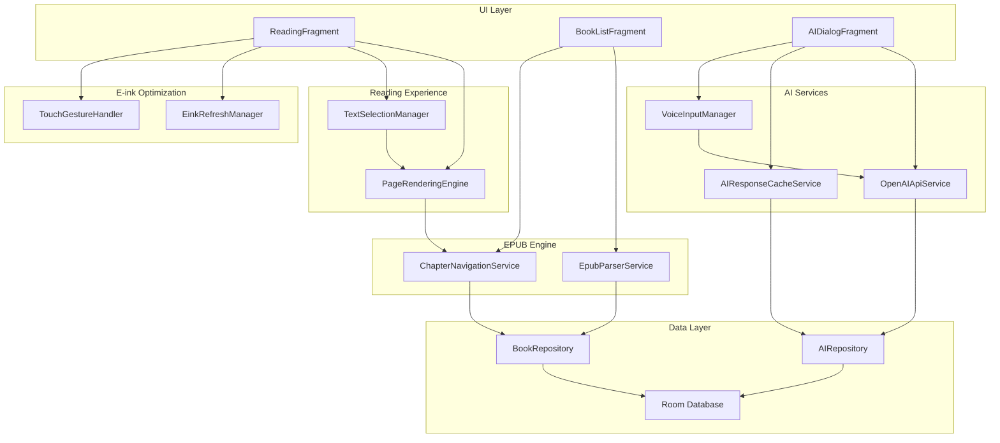
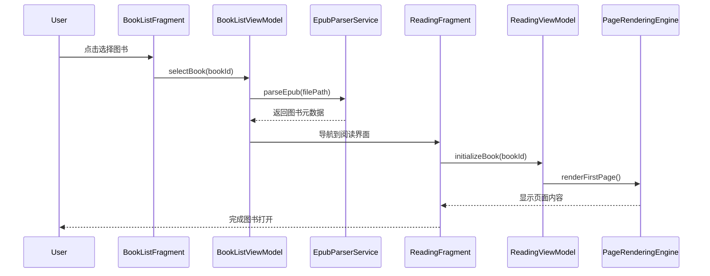
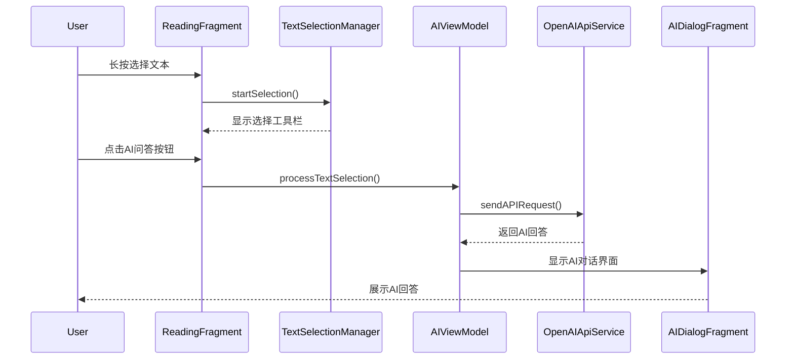

# 墨水屏 AI 阅读器 - 系统架构设计文档

**版本：** 1.0.0  
**日期：** 2024 年 12 月  
**作者：** Winston (AI 架构师)  
**项目：** 墨水屏 AI 阅读器

---

## 📋 目录

1. [项目概述](#项目概述)
2. [架构决策](#架构决策)
3. [技术栈选择](#技术栈选择)
4. [数据模型设计](#数据模型设计)
5. [组件设计](#组件设计)
6. [外部 API 集成](#外部api集成)
7. [核心工作流程](#核心工作流程)
8. [数据库架构](#数据库架构)
9. [源码目录结构](#源码目录结构)
10. [安全考虑](#安全考虑)
11. [性能优化](#性能优化)
12. [监控和日志](#监控和日志)
13. [测试策略](#测试策略)
14. [部署策略](#部署策略)
15. [项目总结](#项目总结)

---

## 项目概述

### 背景和目标

墨水屏 AI 阅读器是专为 Android 墨水屏设备（如文石 P6）设计的智能 EPUB 阅读应用。项目旨在结合先进的 AI 技术与专业的墨水屏优化，为用户提供沉浸式的智能阅读体验。

### 核心功能

- **📚 EPUB 阅读器** - 支持 EPUB 2.0/3.0 格式，优化的渲染性能
- **🤖 AI 智能问答** - 基于 OpenAI API 的文本理解和概念解释
- **🎤 语音交互** - 语音输入识别和 AI 语音回答
- **🖥️ 墨水屏优化** - 智能刷新策略和触控响应优化
- **📊 阅读管理** - 进度跟踪、书签管理、个性化设置

### 目标用户

- **学生和研究人员** - 需要深入理解学术文本和专业术语
- **语言学习者** - 需要实时翻译和词汇解释功能
- **专业阅读者** - 重视阅读体验和知识管理的用户
- **墨水屏设备用户** - 使用文石、Kindle 等 E-ink 设备的用户

---

## 架构决策

### 总体架构方案

**架构风格：** Clean Architecture + MVVM  
**服务架构：** 单体应用（Monolith）  
**数据策略：** 本地优先（Local-First）  
**平台选择：** Android 原生开发

### 关键设计原则

1. **墨水屏优先** - 所有 UI 和交互针对 E-ink 显示特性优化
2. **隐私保护** - 用户数据完全本地存储，不上传任何个人信息
3. **离线优先** - 核心功能无需网络连接即可使用
4. **性能至上** - 针对资源受限设备的深度优化
5. **模块化设计** - 高内聚低耦合的组件架构

### 架构分层

```
┌─────────────────────────────────────────────────┐
│                Presentation Layer                │
│        (Activities, Fragments, ViewModels)      │
├─────────────────────────────────────────────────┤
│                  Domain Layer                   │
│           (Use Cases, Entities, Repositories)   │
├─────────────────────────────────────────────────┤
│                   Data Layer                    │
│    (Local DB, Remote API, File Management)     │
├─────────────────────────────────────────────────┤
│                  Core Modules                   │
│  (EPUB Parser, AI Service, Eink Optimization)  │
└─────────────────────────────────────────────────┘
```

---

## 技术栈选择

### 核心技术决策

| 技术领域      | 选择方案                      | 决策理由                                   |
| ------------- | ----------------------------- | ------------------------------------------ |
| **开发语言**  | Kotlin                        | Android 官方推荐，空安全，协程支持异步处理 |
| **架构模式**  | MVVM + Clean Architecture     | 清晰分层，易测试，可维护性高               |
| **UI 框架**   | Android 原生 + 自定义 WebView | 精确控制墨水屏显示效果                     |
| **数据库**    | Room + SQLite                 | 成熟稳定，支持复杂查询和事务               |
| **网络请求**  | Retrofit + OkHttp             | 标准 HTTP 客户端，支持拦截器和缓存         |
| **异步处理**  | Kotlin Coroutines             | 现代异步编程，避免回调地狱                 |
| **依赖注入**  | Hilt                          | Google 推荐，基于 Dagger2，简化配置        |
| **EPUB 解析** | epublib-android               | 成熟的 EPUB 解析库，支持 2.0/3.0 标准      |
| **AI 集成**   | OpenAI API                    | 业界领先的大语言模型服务                   |

### 开发工具链

- **IDE：** Android Studio
- **构建系统：** Gradle (Kotlin DSL)
- **版本控制：** Git
- **测试框架：** JUnit 5 + Espresso + Mockito
- **静态分析：** Android Lint + Detekt
- **性能分析：** Android Profiler + LeakCanary

---

## 数据模型设计

### 核心实体关系



### 数据设计关键决策

1. **字符串 ID 策略** - 使用 UUID 确保全局唯一性，支持数据迁移
2. **软删除设计** - 关键实体使用`isDeleted`标记，保护用户数据
3. **时间戳统一** - 使用 Long 类型存储毫秒时间戳，避免时区问题
4. **内容哈希缓存** - AI 回答使用内容哈希实现智能缓存

---

## 组件设计

### 系统组件架构



### 关键组件详解

#### 1. EpubParserService（EPUB 解析服务）

**职责：** 解析 EPUB 文件，提取元数据和章节内容

**核心接口：**

```kotlin
interface EpubParserService {
    suspend fun parseEpub(filePath: String): Result<BookMetadata>
    suspend fun extractChapters(filePath: String): List<Chapter>
    suspend fun getChapterContent(filePath: String, chapterPath: String): String
    suspend fun extractCoverImage(filePath: String): String?
    suspend fun validateEpubFile(filePath: String): ValidationResult
}
```

#### 2. OpenAIApiService（AI 服务）

**职责：** 处理 OpenAI API 调用和 AI 功能集成

**核心接口：**

```kotlin
interface OpenAIApiService {
    suspend fun processTextQuestion(
        selectedText: String,
        questionType: QuestionType,
        context: String
    ): Result<AIResponse>

    suspend fun processVoiceInput(
        audioData: ByteArray,
        selectedText: String
    ): Result<AIResponse>

    suspend fun transcribeAudio(audioData: ByteArray): Result<String>
}
```

#### 3. EinkRefreshManager（墨水屏优化）

**职责：** 管理墨水屏刷新策略和显示优化

**核心接口：**

```kotlin
interface EinkRefreshManager {
    fun optimizeRefreshForOperation(operation: RefreshOperation): RefreshMode
    fun configureRefreshStrategy(strategy: RefreshStrategy)
    fun handleGhostingDetection(): Boolean
    fun applyDeviceSpecificOptimizations(deviceProfile: EinkDeviceProfile)
}
```

---

## 外部 API 集成

### OpenAI API 集成方案

#### API 端点使用

1. **Chat Completions API** - 文本智能问答

   - 端点：`POST /v1/chat/completions`
   - 模型：GPT-4
   - 用途：概念解释、翻译、总结、扩展阅读

2. **Whisper API** - 语音转文本
   - 端点：`POST /v1/audio/transcriptions`
   - 模型：whisper-1
   - 用途：语音输入处理

#### 安全措施

- **API 密钥保护** - 分片存储 + Android Keystore 加密
- **请求签名** - 数字签名验证关键请求
- **速率限制** - 本地限流避免 API 滥用
- **错误处理** - 指数退避重试机制

#### 示例配置

```kotlin
class OpenAIConfig {
    companion object {
        const val BASE_URL = "https://api.openai.com/v1/"
        const val DEFAULT_MODEL = "gpt-4"
        const val MAX_TOKENS = 500
        const val TEMPERATURE = 0.3
        const val REQUEST_TIMEOUT = 30_000L // 30秒
        const val MAX_RETRY_ATTEMPTS = 3
    }
}
```

---

## 核心工作流程

### 1. 图书打开流程



### 2. AI 问答交互流程



---

## 数据库架构

### Room 数据库设计

```kotlin
@Database(
    entities = [
        BookEntity::class,
        ChapterEntity::class,
        ReadingProgressEntity::class,
        BookmarkEntity::class,
        AIConversationEntity::class,
        AIResponseEntity::class,
        UserPreferencesEntity::class,
        TextSelectionEntity::class
    ],
    version = 1,
    exportSchema = false
)
@TypeConverters(DatabaseConverters::class)
abstract class InkReaderDatabase : RoomDatabase() {
    abstract fun bookDao(): BookDao
    abstract fun chapterDao(): ChapterDao
    abstract fun readingProgressDao(): ReadingProgressDao
    abstract fun bookmarkDao(): BookmarkDao
    abstract fun aiConversationDao(): AIConversationDao
    abstract fun aiResponseDao(): AIResponseDao
    abstract fun userPreferencesDao(): UserPreferencesDao
    abstract fun textSelectionDao(): TextSelectionDao
}
```

### 关键索引设计

```kotlin
@Entity(
    tableName = "books",
    indices = [
        Index(value = ["bookId"]),
        Index(value = ["createdAt"]),
        Index(value = ["lastOpenedAt"]),
        Index(value = ["isDeleted"]),
        Index(value = ["author", "title"])
    ]
)
data class BookEntity(...)
```

### 数据库优化策略

- **查询优化** - 复合索引支持常用查询模式
- **分页加载** - 大数据集使用 Paging 3 组件
- **事务管理** - 批量操作使用事务确保数据一致性
- **缓存策略** - Room 内置查询缓存 + 应用层 LRU 缓存

---

## 源码目录结构

```
ink-agent/
├── app/
│   ├── src/main/java/com/newbiechen/inkreader/
│   │   ├── application/                   # 应用入口和全局配置
│   │   │   ├── InkReaderApplication.kt
│   │   │   └── di/                        # 依赖注入模块
│   │   ├── presentation/                  # 表现层（MVVM）
│   │   │   ├── activities/
│   │   │   ├── fragments/
│   │   │   ├── viewmodels/
│   │   │   └── adapters/
│   │   ├── domain/                        # 领域层（Clean Architecture）
│   │   │   ├── entities/
│   │   │   ├── usecases/
│   │   │   └── repositories/
│   │   ├── data/                          # 数据层
│   │   │   ├── local/                     # 本地数据源
│   │   │   │   ├── database/
│   │   │   │   ├── preferences/
│   │   │   │   └── file/
│   │   │   ├── remote/                    # 远程数据源
│   │   │   │   └── openai/
│   │   │   └── repositories/              # 仓储实现
│   │   ├── core/                          # 核心功能模块
│   │   │   ├── epub/                      # EPUB处理
│   │   │   ├── ai/                        # AI服务
│   │   │   ├── reading/                   # 阅读体验
│   │   │   └── eink/                      # 墨水屏优化
│   │   └── utils/                         # 工具类
│   ├── src/test/                          # 单元测试
│   └── src/androidTest/                   # UI测试
├── docs/                                  # 项目文档
│   ├── prd.md
│   └── architecture.md
└── README.md
```

### 模块化设计原则

1. **按功能分层** - presentation/domain/data 清晰分离
2. **按业务分组** - core 模块按功能域组织
3. **依赖方向** - 高层模块不依赖低层模块实现
4. **测试友好** - 每个模块都有对应的测试结构

---

## 安全考虑

### 数据保护策略

#### 1. 本地数据加密

```kotlin
// 数据库加密配置
@Database(/* ... */)
@TypeConverters(EncryptionConverter::class)
abstract class InkReaderDatabase : RoomDatabase() {

    companion object {
        fun build(context: Context): InkReaderDatabase {
            val passphrase = KeystoreManager.getOrCreateDatabaseKey()
            return Room.databaseBuilder(context, InkReaderDatabase::class.java, "ink_reader.db")
                .openHelperFactory(SupportFactory(passphrase))
                .build()
        }
    }
}
```

#### 2. API 密钥保护

```kotlin
class OpenAISecurityManager {
    private val keystoreManager = KeystoreManager()

    // API密钥分片保护
    private val keyFragments = arrayOf(
        "sk-proj-",
        getEncryptedFragment1(),
        getEncryptedFragment2()
    )

    fun getSecureApiKey(): String {
        val reconstructedKey = keyFragments.joinToString("")
        return keystoreManager.decrypt(reconstructedKey)
    }
}
```

#### 3. 网络安全

```kotlin
class SecureNetworkModule {
    @Provides
    fun provideSecureOkHttpClient(): OkHttpClient {
        return OkHttpClient.Builder()
            .certificatePinner(
                CertificatePinner.Builder()
                    .add("api.openai.com", "sha256/CERTIFICATE_PIN")
                    .build()
            )
            .addInterceptor(SecurityHeadersInterceptor())
            .protocols(listOf(Protocol.HTTP_2))
            .connectionSpecs(listOf(ConnectionSpec.RESTRICTED_TLS))
            .build()
    }
}
```

### 隐私保护措施

1. **数据最小化** - 仅收集功能必需的最小数据集
2. **用户控制** - 完整的数据导出、删除功能
3. **透明度** - 清晰的隐私政策和数据使用说明
4. **本地处理** - 所有敏感数据在本地处理，不上传

---

## 性能优化

### 墨水屏显示优化

#### 智能刷新策略

```kotlin
class EinkRefreshManager {
    private var fastRefreshCount = 0
    private val maxFastRefreshBeforeGC = 10

    fun optimizeRefreshForOperation(operation: RefreshOperation): RefreshMode {
        return when (operation) {
            RefreshOperation.PAGE_TURN -> {
                fastRefreshCount++
                if (fastRefreshCount >= maxFastRefreshBeforeGC) {
                    fastRefreshCount = 0
                    RefreshMode.FULL_REFRESH
                } else {
                    RefreshMode.FAST_REFRESH
                }
            }
            RefreshOperation.UI_NAVIGATION -> {
                fastRefreshCount = 0
                RefreshMode.FULL_REFRESH
            }
            RefreshOperation.TEXT_SELECTION -> RefreshMode.PARTIAL_REFRESH
        }
    }
}
```

### 内存管理优化

#### 多级缓存策略

```kotlin
class MemoryOptimizedCacheManager {
    // L1缓存：当前章节（内存）
    private val currentChapterCache = LruCache<String, ChapterContent>(1)

    // L2缓存：相邻章节（内存）
    private val adjacentChapterCache = LruCache<String, ChapterContent>(2)

    // L3缓存：图书元数据（持久化）
    private val bookMetadataCache = LruCache<String, BookMetadata>(50)

    // 图片缓存（磁盘+内存）
    private val imageCache = DualLevelImageCache(
        memorySize = 20 * 1024 * 1024,  // 20MB
        diskSize = 100 * 1024 * 1024     // 100MB
    )
}
```

### 性能目标

| 性能指标         | 目标值    | 优化措施               |
| ---------------- | --------- | ---------------------- |
| **应用启动时间** | < 2 秒    | 延迟初始化、预加载优化 |
| **图书打开时间** | < 1.5 秒  | 流式解析、缓存机制     |
| **翻页响应延迟** | < 300ms   | 智能预载、刷新优化     |
| **内存占用**     | < 200MB   | 多级缓存、及时回收     |
| **电池续航**     | > 20 小时 | 后台优化、CPU 节能     |

---

## 监控和日志

### 日志系统设计

```kotlin
object InkReaderLogger {
    private const val MAX_LOG_FILE_SIZE = 10 * 1024 * 1024  // 10MB
    private const val LOG_RETENTION_DAYS = 7

    fun error(tag: String, message: String, throwable: Throwable? = null) {
        val logEntry = createLogEntry(LogLevel.ERROR, tag, message, throwable)
        writeToLogFile(LogLevel.ERROR, logEntry)

        if (throwable != null) {
            ErrorTracker.trackError(throwable, tag, message)
        }
    }

    private fun createLogEntry(
        level: LogLevel,
        tag: String,
        message: String,
        throwable: Throwable? = null
    ): LogEntry {
        return LogEntry(
            timestamp = System.currentTimeMillis(),
            level = level,
            tag = tag,
            message = message,
            threadName = Thread.currentThread().name,
            stackTrace = throwable?.stackTraceToString(),
            sessionId = SessionManager.getCurrentSessionId()
        )
    }
}
```

### 性能监控

```kotlin
class PerformanceMonitor {
    fun trackOperation(operationName: String, block: suspend () -> Unit) {
        val startTime = System.currentTimeMillis()
        val startMemory = getUsedMemory()

        try {
            runBlocking { block() }
        } finally {
            val endTime = System.currentTimeMillis()
            val endMemory = getUsedMemory()

            val metric = PerformanceMetric(
                operationName = operationName,
                duration = endTime - startTime,
                memoryUsed = endMemory - startMemory,
                timestamp = startTime
            )

            checkPerformanceThresholds(metric)
        }
    }
}
```

---

## 测试策略

### 测试金字塔

```
    ┌─────────────────┐
    │   UI测试 10%    │  ← 端到端测试，关键用户流程
    ├─────────────────┤
    │  集成测试 30%   │  ← 组件交互，数据库集成
    ├─────────────────┤
    │  单元测试 60%   │  ← 业务逻辑，工具类测试
    └─────────────────┘
```

### 核心测试用例示例

#### 单元测试

```kotlin
@RunWith(MockitoJUnitRunner::class)
class EpubParserServiceTest {
    @Mock private lateinit var fileManager: FileManager
    @InjectMocks private lateinit var epubParserService: EpubParserService

    @Test
    fun `parseEpub应该成功解析有效的EPUB文件`() = runTest {
        // Given
        val validEpubPath = "test_resources/valid_book.epub"
        whenever(fileManager.exists(validEpubPath)).thenReturn(true)

        // When
        val result = epubParserService.parseEpub(validEpubPath)

        // Then
        assertThat(result.isSuccess).isTrue()
        assertThat(result.getOrNull()?.title).isNotEmpty()
    }
}
```

#### 集成测试

```kotlin
@RunWith(AndroidJUnit4::class)
class BookRepositoryImplTest {
    private lateinit var database: InkReaderDatabase
    private lateinit var repository: BookRepositoryImpl

    @Test
    fun 添加新图书应该触发完整解析流程() = runTest {
        // Given
        val filePath = "/storage/books/test_book.epub"

        // When
        val result = repository.addBook(filePath)

        // Then
        assertThat(result.isSuccess).isTrue()
        val savedBook = database.bookDao().getBookById(result.getOrNull()?.bookId)
        assertThat(savedBook).isNotNull()
    }
}
```

### 设备兼容性测试

```kotlin
@RunWith(Parameterized::class)
class EinkDeviceCompatibilityTest(
    private val deviceProfile: EinkDeviceProfile
) {
    @Test
    fun 墨水屏显示适配测试() {
        configureDeviceEnvironment(deviceProfile)
        launchApp()

        // 验证界面适配
        onView(withId(R.id.reading_webview))
            .check(matches(isDisplayed()))
            .check(matches(hasTextSizeGreaterThan(MIN_READABLE_TEXT_SIZE)))

        // 测试刷新效果
        testRefreshQuality()
    }
}
```

---

## 部署策略

### MVP 构建配置

```kotlin
// build.gradle.kts - 简化的构建配置
android {
    defaultConfig {
        applicationId = "com.newbiechen.inkreader"
        minSdk = 28  // Android 9.0+
        targetSdk = 34
        versionCode = 1
        versionName = "1.0.0-mvp"
    }

    buildTypes {
        release {
            isMinifyEnabled = true
            isShrinkResources = true
            proguardFiles(
                getDefaultProguardFile("proguard-android-optimize.txt"),
                "proguard-rules.pro"
            )
        }
    }
}
```

### 自动化构建脚本

```bash
#!/bin/bash
# build_mvp.sh - MVP版本构建脚本

echo "🚀 开始构建墨水屏AI阅读器 MVP版本..."

# 清理和测试
./gradlew clean
./gradlew testMvpReleaseUnitTest

# 构建APK
./gradlew assembleMvpRelease

echo "✅ 构建完成！"
echo "📱 APK路径: app/build/outputs/apk/mvp/release/app-mvp-release.apk"
echo "📋 安装命令: adb install -r app-mvp-release.apk"
```

### 版本管理

```kotlin
object Version {
    const val MAJOR = 1
    const val MINOR = 0
    const val PATCH = 0
    const val BUILD = 1

    const val NAME = "$MAJOR.$MINOR.$PATCH-mvp"
    const val CODE = MAJOR * 10000 + MINOR * 100 + PATCH * 10 + BUILD

    const val CHANGELOG = """
        v1.0.0-mvp (Build 1)
        - ✨ EPUB图书管理和阅读功能
        - 🤖 AI智能问答（需配置OpenAI API Key）
        - 🎤 语音输入支持
        - 🖥️ 墨水屏显示优化
        - 📱 支持Android 9.0+设备
        - 🔒 完全本地数据存储
    """
}
```

---

## 项目总结

### 架构优势

1. **🎯 明确的技术定位** - 专为墨水屏设备和 AI 阅读优化
2. **🏗️ 现代化架构设计** - Clean Architecture + MVVM 确保代码质量
3. **🔒 隐私优先原则** - 完全本地存储，用户数据安全可控
4. **⚡ 性能工程优化** - 针对资源受限设备的专业调优

### 关键技术决策

- **Kotlin + Android 原生** - 确保性能和设备控制能力
- **Room 数据库** - 稳定可靠的本地数据存储方案
- **OpenAI API 集成** - 业界领先的 AI 能力支持
- **模块化架构** - 高内聚低耦合，便于维护和扩展

### 性能目标

| 指标     | 目标值    | 架构支持      |
| -------- | --------- | ------------- |
| 启动时间 | < 2 秒    | ✅ 延迟初始化 |
| 翻页延迟 | < 300ms   | ✅ 智能缓存   |
| 内存占用 | < 200MB   | ✅ 多级缓存   |
| 电池续航 | > 20 小时 | ✅ 功耗优化   |

### 实施建议

**MVP 开发优先级：**

1. **第一阶段（2-3 周）** - 核心阅读功能
2. **第二阶段（2-3 周）** - AI 功能集成
3. **第三阶段（1-2 周）** - 用户体验优化

**成功关键因素：**

- 早期设备测试和用户反馈
- 持续性能监控和优化
- 清晰的开发优先级管理
- 稳定的 OpenAI API 集成

### 风险评估

| 风险项           | 等级 | 缓解措施               |
| ---------------- | ---- | ---------------------- |
| 墨水屏适配复杂性 | 中   | 早期设备测试，渐进优化 |
| OpenAI API 成本  | 中   | 智能缓存，用户自配密钥 |
| 用户接受度不确定 | 中   | MVP 快速验证，反馈迭代 |

---

**架构设计完成，现在可以开始编码实现！** 🚀

**下一步：** 基于此架构文档进行项目初始化和核心模块开发。

---

_本文档版本：1.0.0_  
_最后更新：2024 年 12 月_  
_架构师：Winston_
